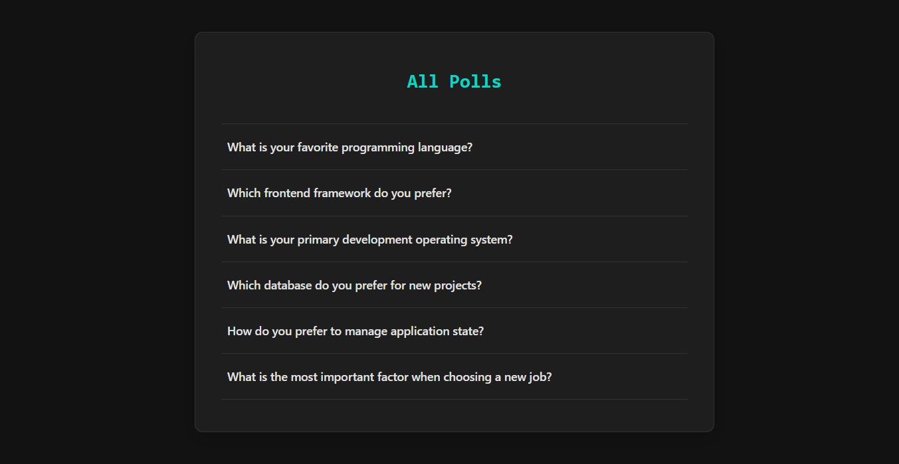

# Full-Stack Poll Application


This project is a complete, full-stack polling application built from scratch to demonstrate modern development practices. It features a TypeScript backend with Node.js/Express and a responsive, dark-themed frontend with React.

It serves as a comprehensive example of building a robust, well-structured, and professionally managed software project, from initial setup to final documentation.



---

## Tech Stack & Key Features

### Backend

- **Language:** TypeScript
- **Framework:** Node.js with Express.js
- **Database:** SQLite (file-based, self-initializing)
- **API:** Versioned REST API (`/api/v1/`)
- **Key Practices:**
  - Intelligent database seeding from a JSON config file.
  - Asynchronous logic handled with modern `async/await`.
  - Robust error handling and status codes.
  - Professional project structure with a dedicated `/server` directory.

### Frontend

- **Language:** TypeScript
- **Library:** React
- **Routing:** React Router DOM for a seamless single-page application experience.
- **Styling:** CSS Modules with a modern, thematic dark mode.
- **Key Practices:**
  - Component-based architecture (`PollList`, `PollDetail`).
  - Data fetching and state management with React Hooks (`useState`, `useEffect`, `useCallback`).
  - Conditional rendering for loading, error, and success states.
  - Centralized type definitions for data shapes.

### Development Workflow & Tooling

- **Version Control:** Git with a disciplined **feature-branch workflow**.
- **Project Management:** **GitHub Projects (Kanban)** was used for task planning, tracking, and visualization from start to finish.
- **Code Quality:** Changes are integrated via **Pull Requests** with clear, descriptive titles and messages, using a **"Squash and merge"** strategy to maintain a clean and readable history on the `main` branch.
- **API Testing:** Manual API validation using a `.http` file with the REST Client extension.
- **Monorepo Structure:** The project is organized as a monorepo with separate, self-contained `client` and `server` applications.

---

## Local Setup and Running Instructions

To run this project on your local machine, please follow these steps.

### Prerequisites

- Node.js (v18 or later recommended)
- npm (v9 or later recommended)

### 1. Clone the Repository

Clone this repository to your local machine:

```bash
git clone https://github.com/joaoptgrilo/fullstack-assessment-prep.git
cd fullstack-assessment-prep
```

### 2. Install Backend Dependencies

Navigate to the server directory and install the required npm packages.

```bash
cd server
npm install
```

### 3. Install Frontend Dependencies

Navigate to the client directory and install its npm packages.

```bash
cd ../client
npm install
```

### 4. Run the Application

You will need two separate terminals to run both the backend and frontend servers simultaneously.

**In your first terminal (for the backend):**

```bash
# Navigate to the server directory
cd server

# Start the backend server (runs on http://localhost:3001)
npm start
```

_The first time you run this, it will automatically create and seed the `polls.db` database file._

**In your second terminal (for the frontend):**

```bash
# Navigate to the client directory
cd client

# Start the React development server
npm start
```

Your browser should automatically open to `http://localhost:3000`, where you can now use the Poll App.
